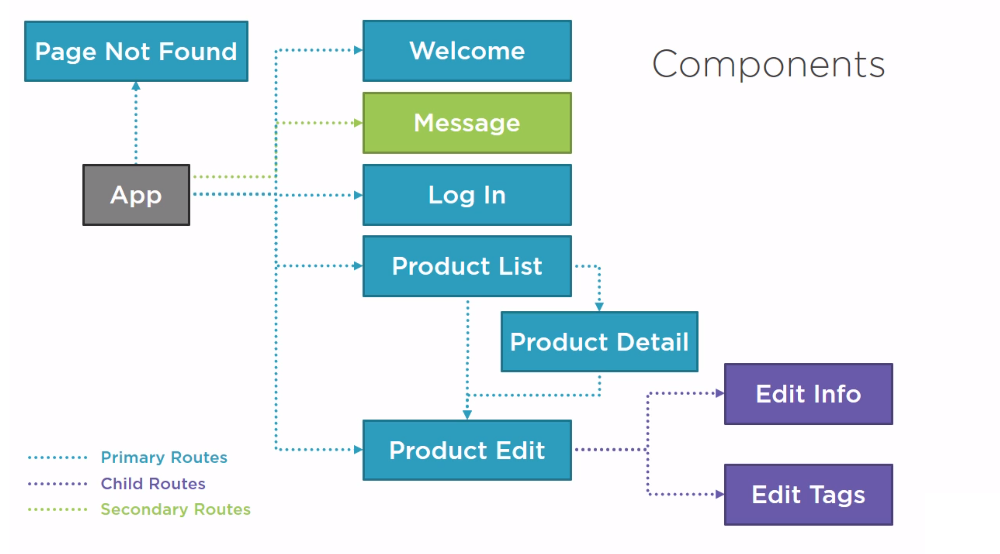
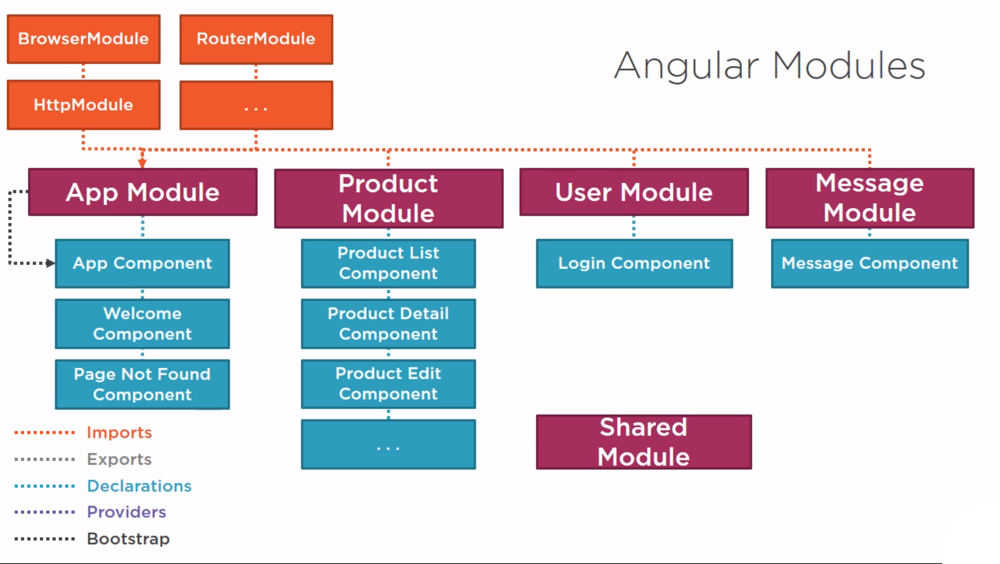

## Description

Electronic store

Components and working of Routing

Modules

## Installation

1) Type: `npm install`
    This installs the dependencies as defined in the package.json file.
    
2) Type: `npm start`
    This launches the TypeScript compiler (tsc) to compile the application and wait for changes. 
    It also starts the lite-server and launches the browser to run the application.
